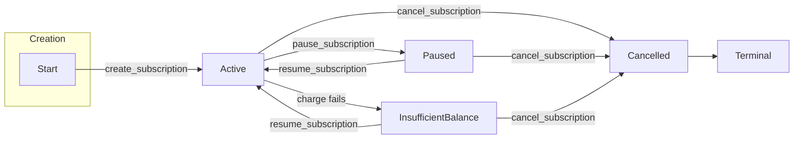

# Subscription Lifecycle and State Machine

This document describes the subscription lifecycle in the SubscriptionVault contract: how subscriptions are created, charged, paused, resumed, and cancelled; how status is represented on-chain; and the state machine that governs valid transitions. It aligns with the implementation in `contracts/subscription_vault/src/`.

For a compact state-machine-only view see [subscription_state_machine.md](subscription_state_machine.md).

---

## Overview

A subscription moves through a lifecycle from creation (always starting **Active**) through optional deposits, charges, and user-driven actions (pause, resume, cancel). The **status** field of each subscription is constrained by a state machine: only certain transitions are allowed (e.g. Active → Paused, InsufficientBalance → Active). Charging is only performed when status is **Active**; insufficient balance during a charge automatically moves the subscription to **InsufficientBalance**. The **prepaid balance** is separate from status: deposits increase balance without changing status; the subscriber must explicitly **resume** after topping up to leave InsufficientBalance.

---

## On-Chain Representation

### Subscription struct

Defined in `contracts/subscription_vault/src/types.rs`:

| Field | Type | Description |
|-------|------|-------------|
| `subscriber` | `Address` | Owner of the subscription; must auth create, deposit. |
| `merchant` | `Address` | Recipient of charges. |
| `amount` | `i128` | Charge amount per interval (in token base units). |
| `interval_seconds` | `u64` | Minimum time between charges. |
| `last_payment_timestamp` | `u64` | Ledger timestamp of last successful charge. |
| **`status`** | **`SubscriptionStatus`** | Lifecycle state; only changed via state machine transitions. |
| `prepaid_balance` | `i128` | Current balance; increased by deposit, decreased by successful charge. |
| `usage_enabled` | `bool` | Usage flag (reserved for future use). |

The **status** field is the only one modified by the state machine. Other fields change only through specific operations: `prepaid_balance` and `last_payment_timestamp` change on deposit and charge; the rest are set at creation (or not changed).

### Storage

Subscriptions are stored in contract instance storage, keyed by subscription id (`u32`). Each key maps to a `Subscription` value. The contract also stores `next_id` for allocating new ids, plus admin/config (token, admin, min_topup).

---

## SubscriptionStatus Variants

The enum is defined in `contracts/subscription_vault/src/types.rs`. Transition rules are implemented in `contracts/subscription_vault/src/state_machine.rs`.

### Active

- **Meaning:** Subscription is active and eligible for charging. Charges succeed when interval has elapsed and balance is sufficient.
- **How entered:** Created by `create_subscription` (initial status); or by `resume_subscription` from Paused or InsufficientBalance.
- **How exited:** `pause_subscription` → Paused; `cancel_subscription` → Cancelled; or a failed charge (insufficient balance) → InsufficientBalance (automatic inside `charge_one`).
- **Charges:** Allowed. `charge_subscription` and `batch_charge` call `charge_one`, which runs only when status is Active.

### Paused

- **Meaning:** Temporarily suspended; no charges are processed.
- **How entered:** `pause_subscription` from Active (authorizer: subscriber or merchant).
- **How exited:** `resume_subscription` → Active; `cancel_subscription` → Cancelled.
- **Charges:** Not allowed. Charge returns `Error::NotActive` (1002) without changing state.

### Cancelled

- **Meaning:** Permanently terminated. No further state changes or charges.
- **How entered:** `cancel_subscription` from Active, Paused, or InsufficientBalance.
- **How exited:** None. Terminal state; no transitions out (any attempt returns `Error::InvalidStatusTransition`).
- **Charges:** Not allowed. Charge returns `Error::NotActive` (1002).

### InsufficientBalance

- **Meaning:** A charge attempt failed because `prepaid_balance < amount`. Subscription is blocked from further charges until the subscriber tops up and then calls `resume_subscription`.
- **How entered:** Only automatically, when `charge_one` (used by `charge_subscription` and `batch_charge`) runs on an Active subscription and balance deduction would underflow (insufficient balance). There is no entrypoint that sets status to InsufficientBalance directly.
- **How exited:** `resume_subscription` → Active (after the subscriber has deposited); `cancel_subscription` → Cancelled. The contract does **not** auto-transition to Active on deposit; the subscriber must call `resume_subscription` after topping up.
- **Charges:** Not allowed. Charge returns `Error::NotActive` (1002).

---

## State Machine and Transitions

### Allowed transitions

| From | To | Trigger |
|------|-----|--------|
| Active | Paused | `pause_subscription(subscription_id, authorizer)` |
| Active | Cancelled | `cancel_subscription(subscription_id, authorizer)` |
| Active | InsufficientBalance | Charge attempted and balance insufficient (inside `charge_one`) |
| Paused | Active | `resume_subscription(subscription_id, authorizer)` |
| Paused | Cancelled | `cancel_subscription(subscription_id, authorizer)` |
| InsufficientBalance | Active | `resume_subscription(subscription_id, authorizer)` |
| InsufficientBalance | Cancelled | `cancel_subscription(subscription_id, authorizer)` |
| *any* | Same | Idempotent: transition to same status is always allowed (e.g. cancel when already Cancelled) |

Implementation: `validate_status_transition` in `contracts/subscription_vault/src/state_machine.rs` is used before every status update; `get_allowed_transitions(status)` returns the list of valid target statuses for a given state.

### Invalid transitions (blocked)

| From | To | Result |
|------|-----|--------|
| Cancelled | Active | `Error::InvalidStatusTransition` (400) — terminal state |
| Cancelled | Paused | `Error::InvalidStatusTransition` (400) |
| Cancelled | InsufficientBalance | `Error::InvalidStatusTransition` (400) |
| Paused | InsufficientBalance | Not reachable (charges not run when Paused) |
| InsufficientBalance | Paused | `Error::InvalidStatusTransition` (400) — must resume or cancel |

### State diagram

---

## Lifecycle Flows

### Creation

- **Entrypoint:** `create_subscription(env, subscriber, merchant, amount, interval_seconds, usage_enabled)`  
  Auth: subscriber.  
  Implemented in `contracts/subscription_vault/src/subscription.rs`.
- **Effect:** A new subscription is stored with `status: Active`, `last_payment_timestamp: env.ledger().timestamp()`, `prepaid_balance: 0`. No charge runs at creation; the first charge requires a deposit and a later `charge_subscription` or `batch_charge` call.

### Deposit

- **Entrypoint:** `deposit_funds(env, subscription_id, subscriber, amount)`  
  Auth: subscriber.  
  Implemented in `subscription.rs`.
- **Effect:** Increases `prepaid_balance` by `amount` (subject to min_topup and non-negative checks). **Status is not changed.** To leave InsufficientBalance after a failed charge, the subscriber must deposit and then call `resume_subscription`.

### Charging

- **Entrypoints:** `charge_subscription(env, subscription_id)` and `batch_charge(env, subscription_ids)`.  
  Auth: admin.  
  Both delegate to `charge_one` in `contracts/subscription_vault/src/charge_core.rs`.
- **Behavior:** Only subscriptions with status **Active** are charged. If status is not Active, `charge_one` returns `Error::NotActive` (1002) without mutating storage. For Active subscriptions: if `now < last_payment_timestamp + interval_seconds`, returns `Error::IntervalNotElapsed` (1001). Otherwise attempts to deduct `amount` from `prepaid_balance`; on success updates balance and `last_payment_timestamp` and returns `Ok(())`; on insufficient balance the subscription is transitioned to **InsufficientBalance**, storage is updated, and the function returns `Err(Error::InsufficientBalance)` (1003).

### Pause / Resume / Cancel

- **Pause:** `pause_subscription(env, subscription_id, authorizer)` — validates transition to Paused, then sets `status = Paused`. Auth: subscriber or merchant. Implemented in `subscription.rs`.
- **Resume:** `resume_subscription(env, subscription_id, authorizer)` — validates transition to Active, then sets `status = Active`. Auth: subscriber or merchant. Implemented in `subscription.rs`.
- **Cancel:** `cancel_subscription(env, subscription_id, authorizer)` — validates transition to Cancelled, then sets `status = Cancelled`. Auth: subscriber or merchant. Implemented in `subscription.rs`.

All three use `validate_status_transition` before updating status.

---

## Invariants and Edge Cases

1. **Only Active subscriptions are charged.** Paused, Cancelled, and InsufficientBalance cause `charge_one` to return `Error::NotActive` (1002) immediately, with no state change.

2. **InsufficientBalance is only entered by a failed charge.** There is no entrypoint that sets status to InsufficientBalance; it is set only inside `charge_one` when deduction would underflow. See `contracts/subscription_vault/src/charge_core.rs`.

3. **Cancelled is terminal.** No transitions out of Cancelled; resume and all other status changes from Cancelled return `Error::InvalidStatusTransition` (400).

4. **Idempotent same-status.** Transitioning to the same status (e.g. calling cancel when already Cancelled) is allowed by `validate_status_transition`, so callers can safely retry.

5. **Resume from InsufficientBalance is explicit.** Depositing does not change status. After topping up, the subscriber must call `resume_subscription` to move back to Active before the next charge can succeed.

6. **Interval check.** A charge is only attempted when `now >= last_payment_timestamp + interval_seconds`; otherwise `Error::IntervalNotElapsed` (1001) is returned.

7. **Batch charge.** `batch_charge` invokes `charge_one` per id; each subscription’s status is updated independently (e.g. one can move to InsufficientBalance while others succeed). Per-item errors are reported in `BatchChargeResult`; see `docs/batch_charge.md`.

---

## Error Codes (Lifecycle-Relevant)

From `contracts/subscription_vault/src/types.rs`:

| Code | Variant | When |
|------|---------|------|
| 400 | `InvalidStatusTransition` | Invalid status transition (e.g. Cancelled → Active). |
| 401 | `Unauthorized` | Caller not authorized (e.g. not admin for charge, not subscriber/merchant for cancel/pause/resume). |
| 402 | `BelowMinimumTopup` | Deposit below configured min_topup. |
| 404 | `NotFound` | Subscription id not found. |
| 1001 | `IntervalNotElapsed` | Charge attempted before interval elapsed. |
| 1002 | `NotActive` | Charge attempted on non-Active subscription. |
| 1003 | `InsufficientBalance` | Charge failed due to insufficient prepaid balance (and status set to InsufficientBalance). |

---

## Example Timelines

### Happy path

1. Subscriber: `create_subscription` → subscription stored, status **Active**, balance 0.
2. Subscriber: `deposit_funds` → balance increased, status remains Active.
3. Admin: `charge_subscription` (after interval elapsed) → balance decreased, `last_payment_timestamp` updated, status Active.
4. Repeat 2–3 as needed; eventually subscriber or merchant: `cancel_subscription` → status **Cancelled** (terminal).

### Insufficient balance then recover

1. Create → Active; deposit some funds.
2. Admin: `charge_subscription` (or interval elapses and batch runs) → balance too low → subscription moves to **InsufficientBalance**, call returns `Error::InsufficientBalance` (1003).
3. Subscriber: `deposit_funds` → balance increased, status still InsufficientBalance.
4. Subscriber: `resume_subscription` → status **Active**.
5. Admin: `charge_subscription` (when interval elapsed) → charge succeeds.

### Pause and resume

1. Subscription is Active. Subscriber or merchant: `pause_subscription` → **Paused**.
2. Later: same or other party: `resume_subscription` → **Active**. Alternatively: `cancel_subscription` from Paused → **Cancelled**.

---

## Code References

| Area | File | Description |
|------|------|-------------|
| Entrypoints | `contracts/subscription_vault/src/lib.rs` | Public API: create, deposit, charge, cancel, pause, resume, batch_charge, queries. |
| Lifecycle (create, cancel, pause, resume) | `contracts/subscription_vault/src/subscription.rs` | `do_create_subscription`, `do_deposit_funds`, `do_cancel_subscription`, `do_pause_subscription`, `do_resume_subscription`. |
| Single charge and Active → InsufficientBalance | `contracts/subscription_vault/src/charge_core.rs` | `charge_one`: only runs when Active; on balance failure sets status to InsufficientBalance. |
| Transition rules | `contracts/subscription_vault/src/state_machine.rs` | `validate_status_transition`, `get_allowed_transitions`, `can_transition`. |
| Types | `contracts/subscription_vault/src/types.rs` | `Subscription`, `SubscriptionStatus`, `Error`, `BatchChargeResult`. |
